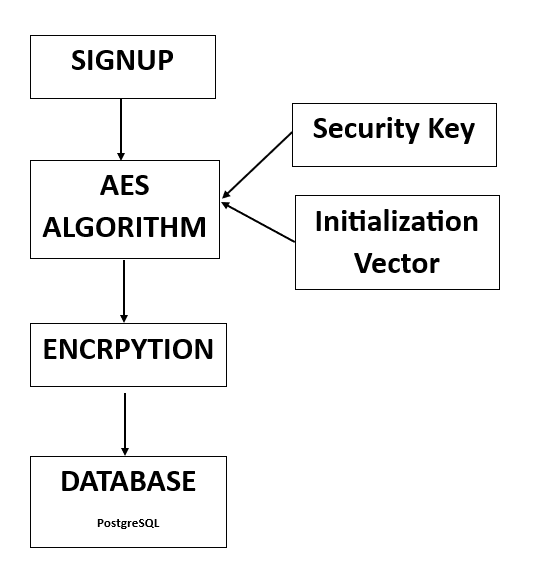
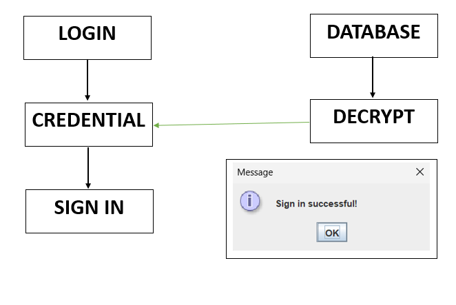

# JavaCrypt 🔐

JavaCrypt is a Java-based encryption and decryption tool designed for secure data transmission and storage. It provides a user-friendly GUI built using NetBeans and integrates PostgreSQL for secure key management and user authentication.

## 📌 How It Works

### **Encryption Process**
1. A user signs up by providing credentials.
2. The credentials are encrypted using the AES algorithm with a security key and an initialization vector.
3. The encrypted data is stored securely in the PostgreSQL database.

### **Decryption Process**
1. During login, the stored credentials are retrieved from the database.
2. The encrypted credentials are decrypted using the AES algorithm.
3. If the decrypted credentials match, access is granted.

### **Architecture Diagram**

#### **Encryption Flow**


#### **Decryption Flow**


---

## 🚀 Getting Started

### **Prerequisites**
Ensure you have the following installed:
- **Apache NetBeans IDE 22**
- **PostgreSQL 15**
- **Java 22.0.1 (JDK 22)**
- **PostgreSQL JDBC Driver** (`postgresql-42.5.4.jar`)

### **Installation Steps**

#### 1. Clone the Repository
```sh
git clone https://github.com/AAKASH-do/JavaCrypt.git
cd JavaCrypt
```

#### 2. Configure the `.env` File
Create a `.env` file in the root directory with the following content:
```ini
DB_URL=jdbc:postgresql://localhost:5432/your_database
DB_USER=your_username
DB_PASSWORD=your_password
```
Replace `your_database`, `your_username`, and `your_password` with your actual PostgreSQL credentials.

#### 3. Set Up PostgreSQL Database
Run the following SQL commands to create the required tables:
```sql
CREATE TABLE users (
    id SERIAL PRIMARY KEY,
    username VARCHAR(255) UNIQUE NOT NULL,
    password_hash TEXT NOT NULL
);

CREATE TABLE transactions (
    id SERIAL PRIMARY KEY,
    user_id INT REFERENCES users(id),
    encrypted_data TEXT NOT NULL,
    created_at TIMESTAMP DEFAULT CURRENT_TIMESTAMP
);
```

#### 4. Run the Application
- Open the project in **NetBeans IDE**.
- Run the `LoginAndSignUp.java` file.

---

## 🛠️ Project Structure

```
JavaCrypt/
│── src/
│   ├── LoginAndSignUp.java  # Main entry point
│   ├── SecureEncryption.java  # Encryption logic
│   ├── DatabaseConnector.java  # Handles PostgreSQL connections
│   ├── .env  # Environment variables (not committed)
│── nbproject/  # NetBeans project files
│── README.md  # Documentation
│── postgresql-42.5.4.jar  # JDBC driver
│── architecture.png  # Architecture diagram
```

---

## 💽 Built With
- **Java 22.0.1** - Core programming language
- **Apache NetBeans 22** - Development environment
- **PostgreSQL 15** - Database management
- **PostgreSQL JDBC Driver (42.5.4)** - Java-PostgreSQL connection
- **Java Cryptography API** - Secure encryption

---

## 👨‍💻 Author
**Developed by Aakash P**  
GitHub: [AAKASH-do](https://github.com/AAKASH-do)

